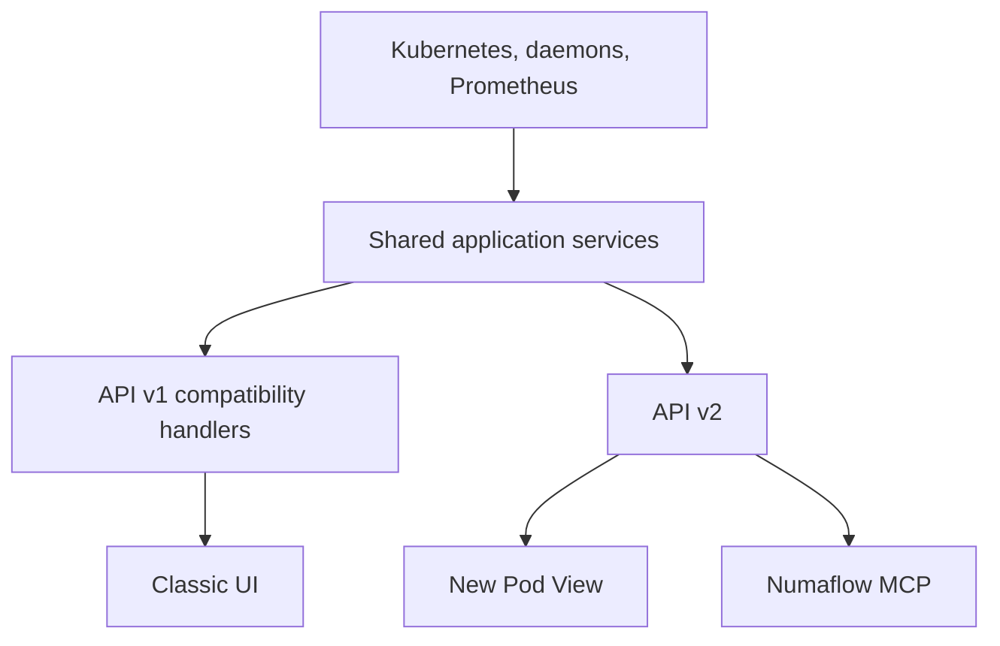
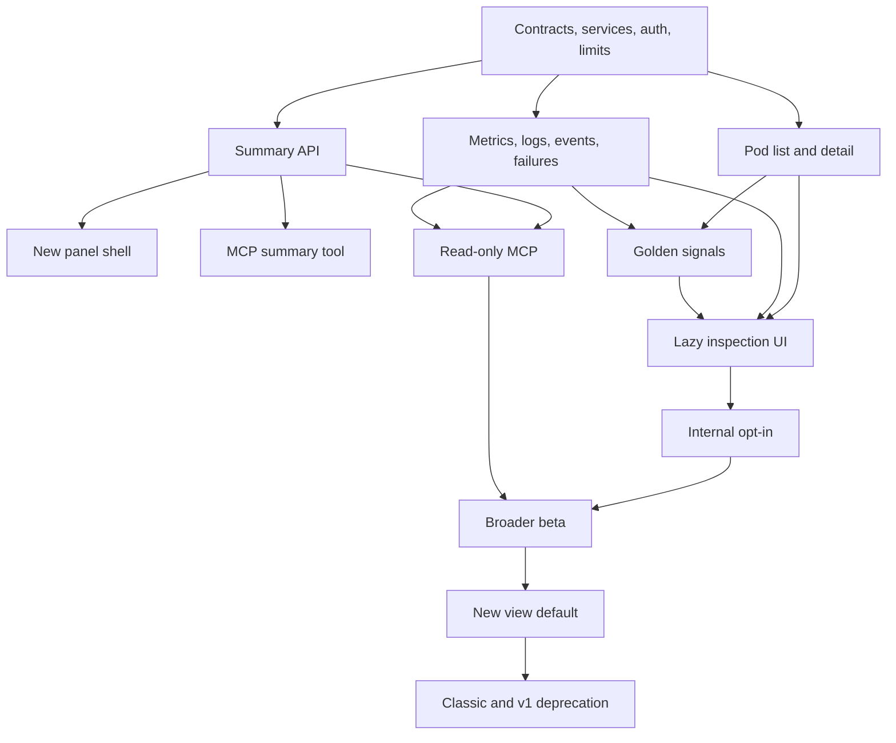

# Pod View v2 Plan

## Goal

Introduce the redesigned Pod View without replacing the classic view immediately.

- The classic UI remains the default initially.
- Eligible users can opt into the new view and switch back.
- The new view uses API v2 exclusively.
- API v2 exposes small, task-oriented operations instead of large state dumps.
- Numaflow MCP uses the same API v2 operations as the new UI.

Out of scope:

- #3511 — Grafana integration
- #3512 — tracing integration
- #3515 — external observability configuration

Retained from #3509:

- #3510 — golden signals
- #3513 — improved log experience on API v2
- #3514 — shareable and deep-linkable state

## Current State

The Pod View is the `Pods View` tab inside the vertex details sidebar.

Relevant code:

- [VertexDetails](../ui/src/components/common/SlidingSidebar/partials/VertexDetails/index.tsx) owns the sidebar tabs.
- [Pods](../ui/src/components/pages/Pipeline/partials/Graph/partials/NodeInfo/partials/Pods/index.tsx) renders the current Pod View.
- [podsViewFetch](../ui/src/utils/fetcherHooks/podsViewFetch.ts) fetches raw Pods and namespace-wide metrics separately.
- [observabilityURLState](../ui/src/utils/observabilityURLState.ts) contains the #3514 deep-link state.
- [API v1 handler](../server/apis/v1/handler.go) contains most current server logic.
- [routes.go](../server/routes/routes.go) registers API v1 routes.

Today the UI joins several large responses itself. API v2 should return compact data shaped around specific operations.

## Architecture

### Shared application layer

Create transport-independent services under:

`server/application/observability`

These services should:

- read from Kubernetes, metrics-server, daemons, and Prometheus;
- normalize Pipeline vertex and MonoVertex data;
- enforce pagination and response limits;
- be reused by API v1 where practical;
- contain no Gin or UI-specific logic.

### API style

Use a combination of:

- resource reads for summaries and details;
- explicit queries for metrics and diagnostics;
- named commands for side effects.

Do not add a general `get everything` endpoint.

## API v2 Surface

Use equivalent contracts for:

- `/api/v2/namespaces/{namespace}/pipelines/{pipeline}/vertices/{vertex}`
- `/api/v2/namespaces/{namespace}/mono-vertices/{monoVertex}`

### Summary and status

- `GET {target}/summary`
  - Name, type, phase, health, desired phase, generation, timestamps, and supported capabilities.
  - No Pods, spec, logs, events, or metric series.
- `GET {target}/status`
  - Conditions, replica counts, resource health, data health, and transitions.
- `GET {target}/metadata`
  - Requested labels, annotations, UID, and timestamps.
- `GET {target}/spec`
  - Selected vertex or MonoVertex spec, loaded only when requested.
- `GET .../pipelines/{pipeline}/vertices`
  - Paginated vertex summaries.

### Pods and containers

- `GET {target}/pods`
  - Paginated, searchable, and filterable pod summaries.
  - Optional compact usage data through `include=usage`.
- `GET {target}/pods/{pod}`
  - Pod status, reason, node, restarts, timestamps, usage, and container summaries.
- `GET {target}/pods/{pod}/containers/{container}`
  - Container state, readiness, termination details, requests, limits, and usage.

Never return raw Kubernetes Pod objects from these operations.

### Golden signals and metrics

- `GET {target}/signals`
  - Latency, traffic, errors, and saturation.
  - Each signal has a value, unit, severity, timestamp, and availability state.
- `GET {target}/metric-descriptors`
  - Supported metric IDs, dimensions, filters, units, and aggregations.
- `POST {target}/metrics:query`
  - Explicit metric, time range, step, dimensions, filters, and maximum points.
- `GET {target}/rates`
  - Processing-rate summaries.
- `GET {target}/buffers`
  - Paginated buffer information when applicable.

Raw PromQL should not be exposed to UI or MCP consumers.

### Logs, events, failures, and diagnostics

- `GET .../containers/{container}/logs`
  - Bounded log snapshot with `tailLines`, `since`, and `previous`.
- `GET .../containers/{container}/logs:stream`
  - Cancellable live stream for the active UI.
- `GET {target}/events`
  - Paginated and filtered Kubernetes events.
- `GET {target}/failures`
  - Paginated and filtered daemon/container failures.
- `POST {target}/diagnostics:query`
  - Runs explicitly requested checks and returns independent structured results.

Logs remain limited by Kubernetes retention.

### Discovery and actions

- `GET /api/v2/capabilities`
  - Effective rollout policy, API limits, and permitted capabilities.
- `GET {target}/watch`
  - Optional SSE invalidations for status, Pods, and events.
  - Implement only if load testing shows it is better than polling.
- `POST .../actions/pause`
- `POST .../actions/resume`
- `GET /api/v2/operations/{operationId}`

Mutations require authorization and an idempotency key. MCP mutations remain disabled by default.

## API Rules

- Define API v2 in `api/openapi-spec/numaflow-v2.yaml`.
- Generate typed Go and TypeScript clients from the contract.
- Use cursor pagination for all potentially large lists.
- Use named filters and sorts rather than arbitrary expressions.
- Use RFC 9457 structured errors with stable error codes and field violations.
- Use numeric values with explicit units.
- Bound log lines, metric points, page size, response bytes, and provider calls.
- Support ETags for cacheable summaries and details.
- Permit only documented, one-level expansions.
- Never perform one metrics-server request per Pod.
- Track latency, response bytes, provider calls, errors, and authorization denials per operation.

## New UI Loading

### Initial panel load

Fetch in parallel:

1. Vertex or MonoVertex summary.
2. First page of Pod summaries with usage.
3. Golden signals.

Render the panel shell immediately. Each section has its own loading and error state.

### Lazy loading

Load only when selected:

- detailed status;
- selected Pod and container;
- logs;
- metric descriptors and expanded charts;
- processing rates;
- buffers;
- events;
- failures;
- spec;
- diagnostics.

A direct Pod, container, log, or metric link should fetch that resource directly instead of scanning earlier list pages.

### Cache and refresh

- Use a v2-scoped TanStack Query cache.
- Poll status and Pods only while the panel is visible.
- Refresh events and failures only while their tabs are active.
- Fetch metrics only when the selected metric or time range changes.
- Keep one cancellable log stream for the active container.
- Pause background refresh when the browser tab is hidden.
- Retain polling as the fallback if SSE is introduced.

Tests must fail if the new Pod View calls `/api/v1`.

## Classic-to-New Migration

Add a server-controlled rollout policy:

- `disabled`
- `internal`
- `optIn`
- `default`
- `required`

The capabilities response tells the UI:

- whether the user is eligible;
- the default experience;
- whether classic fallback is allowed.

Store the user's choice in local storage because Numaflow has no user-profile store today.

Experience selection order:

1. Server eligibility or forced policy.
2. Valid URL override.
3. Local preference.
4. Server default.

Migration behavior:

- Classic remains the initial default.
- Eligible users see an opt-in banner.
- The new view includes a “Use classic view” action.
- Switching views preserves #3514 URL state.
- Only the vertex-details content changes; the graph and top-level routes remain shared.
- The new component receives only a target reference and cannot consume data fetched for the classic view.

## Numaflow MCP

MCP should be a thin API v2 client. It must not call Kubernetes or daemon clients directly.

### Lessons from the existing MCP branch

The [`feat/mcp-layer-over-api`](https://github.com/numaproj/numaflow/tree/feat/mcp-layer-over-api) branch is a useful prototype, but not the final architecture.

Reuse:

- compact status, pending, topology, and runtime-error DTOs;
- numeric values, explicit timestamps, and stable error codes;
- bounded logs and events;
- independent diagnostic sections with `data`, `error`, and `observedAt`;
- read-only, non-destructive, and idempotent MCP tool annotations;
- tests that reject mutation tools and enforce limits.

Change:

- do not create synthetic Gin requests or dispatch directly into API v1 handlers;
- do not authorize all MCP calls through one wildcard `/mcp` permission;
- do not expose full Pipeline/MonoVertex CRs, raw Pods, or namespace-wide metrics;
- do not merge logs from an unbounded number of replicas into one tool result;
- enforce all limits in API v2, not only in the MCP adapter;
- return truncation and pagination metadata in response bodies rather than only headers;
- use one API v2 error model instead of mixing HTTP errors and v1 `{errMsg,data}` responses.

MCP must call API v2 through its generated HTTP client. API v2 performs authorization for the namespace, resource, and operation supplied by each tool.

Initial read-only tools:

- `get_vertex_summary`
- `get_vertex_status`
- `list_vertices`
- `list_pods`
- `get_pod`
- `get_container`
- `get_golden_signals`
- `list_recent_events`
- `list_recent_failures`
- `get_logs`
- `list_metric_descriptors`
- `query_metric`
- `run_diagnostics`

Agent safeguards:

- conservative pagination and time-range defaults;
- bounded logs, metric points, response bytes, and provider fan-out;
- stable identifiers and predictable schemas;
- structured validation errors;
- no raw CRD, Kubernetes object, PromQL, or arbitrary patch tools;
- logs require an explicit Pod and container; MCP never enables live follow;
- prefer requested diagnostic checks over a broad debug snapshot;
- keep the initial tool catalog small instead of copying all 43 prototype tools;
- Bearer authentication using the same API authorization as the UI.

Pause and resume tools can be added later behind explicit permission, idempotency, audit, and confirmation controls.

## Delivery Order

## Issue-Sized Work

### 1. API v2 contract and guardrails

- Define the OpenAPI contract, response budgets, pagination, errors, operations, and naming.
- Add generated Go and TypeScript clients with CI drift checks.
- Done when all redesigned UI and MCP operations have bounded contracts.

### 2. Shared observability services

- Extract Pod normalization and provider access from API v1 handlers.
- Support Pipeline vertices and MonoVertices through shared interfaces.
- Done when migrated v1 tests pass without Gin inside the service layer.

### 3. Authentication and authorization

- Add Bearer authentication alongside browser cookies.
- Single-source route authorization metadata.
- Preserve namespace and read-only restrictions.
- Authorize every MCP-backed API call using its namespace, resource, and operation; access to the MCP transport alone grants no resource access.
- Done when UI and MCP identities pass the same per-operation allow/deny tests.

### 4. Summary vertical slice

- Implement summary and status endpoints.
- Build the new panel header and loading shell.
- Add a development MCP summary tool.
- Done when the new shell renders using only API v2.

### 5. Opt-in migration boundary

- Add capabilities policy, local preference, banner, view switch, and URL override.
- Keep classic as default and preserve deep-link state while switching.
- Done when all eligibility/default/fallback combinations are tested.

### 6. Pod fleet API and UI

- Add paginated Pod summaries plus Pod/container detail endpoints.
- Build fleet search, filters, severity, usage, and selected details.
- Done when large fleets remain bounded and no raw Pod objects or N+1 metric calls remain.

### 7. Metrics, rates, and buffers

- Add metric descriptors, bounded metric queries, rates, and buffer operations.
- Load charts only when expanded.
- Done when large ranges are rejected or downsampled and raw PromQL stays private.

### 8. Logs

- Add bounded snapshot and cancellable stream contracts.
- Enforce maximum lines, response bytes, and replicas in API v2.
- Require an explicit Pod/container for MCP and never expose `follow`.
- Port #3513 search, virtualization, previous logs, and display controls.
- Done when disconnected streams close and the UI preserves existing log behavior.

### 9. Events and failures

- Add filtered, paginated events and failures.
- Remove client-side replica-error flattening.
- Done when filtering and ordering are deterministic.

### 10. Golden signals

- Define and implement latency, traffic, errors, and saturation for #3510.
- Return `unavailable` when a required source is missing instead of returning zero.
- Done when formulas, units, and drill-down mappings are approved for each vertex type.

### 11. Spec, metadata, and vertex discovery

- Add lazy spec and metadata operations plus paginated vertex summaries.
- Done when the new panel does not need a full Pipeline CR.

### 12. Diagnostics

- Add explicit diagnostic checks over status, Pods, signals, events, and failures.
- Reuse the MCP branch's independent `data`, `error`, and `observedAt` section pattern, but return only requested checks.
- Return structured evidence, stable error codes, and bounded partial results.
- Done when no diagnostic response is a large state dump or prose-only answer.

### 13. Complete lazy UI and deep links

- Wire every tab to its narrow API operation.
- Reuse #3514 state for Pod, container, logs, metrics, filters, and selected tab.
- Done when closed sections issue no requests and section failures are isolated.

### 14. Read-only MCP

- Add the MCP command, generated API client, resources, and inspection tools.
- Start with local stdio transport and explicit server URL/Bearer token configuration.
- Do not reuse the prototype's `httptest`/Gin dispatch or API v1 route switch.
- Done when MCP imports no Gin, API v1, Kubernetes, CRD, or daemon packages and all output limits are tested.

### 15. Mutation safety

- Add idempotent operations and optional pause/resume MCP tools.
- Keep mutations disabled by default.
- Done when duplicate requests cannot repeat effects and every action is authorized and audited.

### 16. Contract and compatibility testing

- Test OpenAPI examples, generated clients, errors, pagination, auth, and v1 compatibility.
- Done when every public v2 operation has success, failure, and authorization coverage.

### 17. Performance testing

- Compare classic/v1 and new/v2 with 0, 50, and 500 Pods.
- Measure response bytes, provider calls, p95 latency, memory, and UI render time.
- Done when agreed budgets become release gates.

### 18. UI migration testing

- Test opt-in, fallback, deep links, direct links, accessibility, and error isolation.
- Assert that the new view never calls API v1.
- Done when switching views never loses shareable state.

### 19. MCP safety evaluation

- Test common diagnosis workflows, pagination, stale IDs, cross-namespace denial, bad inputs, token expiry, truncation, and replica fan-out.
- Add an architecture test that prevents MCP from importing API v1 handlers or cluster clients.
- Done when tasks complete through narrow calls within output budgets and every tool is authorized by its underlying API v2 operation.

### 20. Rollout and deprecation

- Add internal cohorts, telemetry, rollback, support runbooks, beta expansion, and default-switch gates.
- Instrument API v1 use before announcing deprecation.
- Done when classic and individual v1 operations are removed only after a published sunset and accepted remaining usage.

## Rollout

### Phase 0 — Contracts and foundations

OpenAPI, shared services, authentication, authorization, limits, and observability.

### Phase 1 — Minimal v2 and panel shell

Summary/status API, hidden new panel, migration boundary, and MCP summary smoke tool.

### Phase 2 — Core inspection

Pods, containers, metrics, rates, buffers, logs, events, failures, spec, metadata, and diagnostics.

### Phase 3 — Retained #3509 scope

Complete #3510 golden signals and verify #3513 logs plus #3514 deep links on API v2.

### Phase 4 — MCP

Ship the read-only MCP tools. Keep mutation tools disabled until separately approved.

### Phase 5 — Internal opt-in

Enable selected environments, namespaces, or identity groups with immediate rollback.

### Phase 6 — Broader beta

Expand opt-in access after compatibility, performance, and support gates pass.

### Phase 7 — New view default

Make the new Pod View the default while retaining the classic fallback.

### Phase 8 — Deprecation

Freeze API v1 additions, publish deprecation notices, migrate known consumers, and retire classic UI/API v1 operations independently.

## Key Risks

- Golden-signal definitions are incomplete across all vertex types.
- The Figma mock shows per-Pod pending messages, but current pending data is vertex/buffer scoped.
- Current Pod details can cause one metrics request per Pod.
- Existing authorization is based on HTTP methods and broad resource types.
- The prototype MCP's wildcard `/mcp` authorization does not enforce each tool's namespace or resource.
- Broad raw-object tools and multi-replica log fan-out can exhaust agent context.
- Kubernetes logs cannot provide unlimited history.
- SSE may consume more resources than polling through some proxies.
- API v2 could grow into another aggregate API without enforced response and provider-call budgets.

The default response to each risk is to keep contracts narrow, make unavailable data explicit, and require measured evidence before adding convenience expansions.
